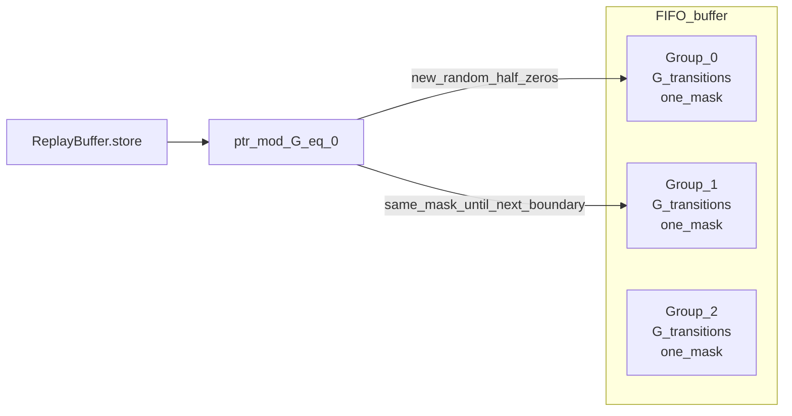
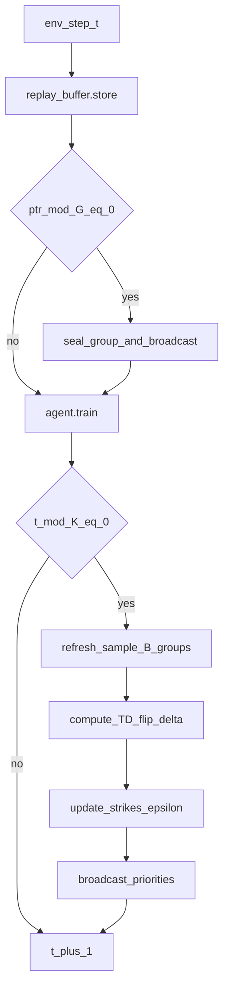

# PIToD and Dynamic PIToD: theory and implementation

This note is a presentation-oriented walkthrough of **static PIToD** from [Hiraoka et al., 2025](https://openreview.net/forum?id=pUvF97zAu9) as implemented in this repository, and of **Dynamic PIToD**, the extension that rescores experience groups during training and drives prioritized replay. It ties ideas to concrete code paths so you can explain both the math and what runs on the machine.

For install, commands, and citations, see [README.md](README.md). For runnable flags and examples, see [HOW_TO_RUN.md](HOW_TO_RUN.md) and [COLAB-DYNAMIC-PITOD.md](COLAB-DYNAMIC-PITOD.md).

---

## 1. Problem statement

**Markov decision process (MDP).** An agent interacts with an environment: at each step it observes a state, chooses an action, receives a reward, and transitions to a next state. The goal is to learn a policy that maximizes expected long-term return (typically discounted).

**Replay buffer.** Off-policy algorithms such as SAC store past transitions \((s, a, r, s', \text{done})\) in a fixed-size FIFO buffer and sample mini-batches from it to update neural networks. Not all stored transitions are equally useful: some stabilize value estimates, some add little information, and some (for example early, noisy, or misleading data) can hurt performance or bias Q-functions.

**Influence estimation.** We want to know which stored experiences *influence* the agent’s behavior or value predictions, ideally **without** running leave-one-out (LOO) retraining. True LOO would retrain once per subset of removed data and is prohibitively expensive when the buffer holds millions of transitions.

**PIToD (Projected Influence with Turn-Over Dropout).** The paper introduces a tractable way to attribute influence by combining **experience groups** with **macro dropout** (structured sparsity in the networks). You can measure how much “turning off” the subnetwork configuration associated with a group changes returns or TD error, using only forward passes at the current parameters.

**Why it matters in practice.** The same machinery supports debugging: identifying and down-weighting or masking experiences that hurt the agent. The repository README links to demonstration videos of that process.

---

## 2. Base agent: Soft Actor-Critic (SAC) and REDQ

**SAC (Soft Actor-Critic).** SAC learns a stochastic policy that maximizes reward plus an entropy bonus, encouraging exploration. A temperature coefficient \(\alpha\) (often learned) trades off exploitation and entropy. Two Q-networks (or more) approximate action values \(Q(s,a)\); targets use a **clipped double-Q** style construction to reduce overestimation.

**REDQ-style ensemble in this codebase.** The implementation lives in [`redq/algos/redq_sac.py`](redq/algos/redq_sac.py) (`REDQSACAgent`). It maintains `num_Q` Q-networks (default 2). For the Bellman target, it subsamples `num_min` of them and takes the **minimum** over next-state Q-values (REDQ trick) to combat overestimation. The policy is Gaussian; \(\alpha\) can be auto-tuned against a target entropy.

**Update-to-data ratio (UTD).** After enough data is collected (`delay_update_steps`), each environment step triggers `utd_ratio` gradient updates (default 4), so learning is sample-efficient but heavier per step than one update per transition.

**Where training happens.** `REDQSACAgent.train()` performs Q-updates, optional PER priority writeback, policy and \(\alpha\) updates, and Polyak averaging of target networks. When replay is non-uniform, **importance-sampling (IS) weights** multiply per-sample losses (see Section 7).

---

## 3. Turn-over dropout (ToD) and experience groups

These definitions are the vocabulary for everything that follows.

**Experience group.** A contiguous block of `experience_group_size` transitions (default \(G = 5000\)) in the replay buffer. All transitions in the block share **one** binary **mask** generated at the start of the block.

**Mask.** A vector of length `mask_dim` (default 20) with entries in \(\{0,1\}\). When the write pointer aligns with a group boundary, the code picks a random subset of exactly `mask_dim / 2` indices and sets those entries to 0; the rest stay 1. Intuitively, half of the macro-dropout “channels” are active and half inactive for that group.

**Flip.** Networks take arguments `masks` and `flips`. With `flips=False`, the mask is applied as stored. With `flips=True`, the implementation uses the **complement** of that mask (the roles of active and inactive channels are swapped). Comparing predictions with `flips=False` vs `flips=True` is how we probe sensitivity to the subnetwork pattern tied to that group—**without retraining**.

**Macro dropout (structured dropout in the MLP).** The Q and policy MLPs (`Mlp` in [`redq/algos/core.py`](redq/algos/core.py)) use the mask to gate subnetworks (see Appendix C of the paper for the full treatment). This is not independent per-weight dropout on every forward pass; it is a **coarse, group-level** structural constraint.

**Mask assignment in code** when a transition is stored:

```109:115:redq/algos/core.py
        # create and store mask associated for the data
        if (self.ptr % self.experience_group_size) == 0:
            # dropout rate of ToD = 0.5
            self.ids_zero_elem = np.random.permutation(self.mask_dim)[:int(self.mask_dim / 2)]
        mask = np.ones([self.mask_dim], dtype=np.int32)
        mask[self.ids_zero_elem] = 0.0
        self.masks_buf[self.ptr] = mask
```

**Why the group is the unit of influence.** Influence is defined relative to a **shared** mask pattern. You cannot assign independent per-transition macro masks in this design without losing the group abstraction the estimator uses.



---

## 4. Static PIToD: measuring influence

Static PIToD here means: **training typically samples uniformly** from the buffer (see `main-TH.py`), while **evaluation / analysis** periodically estimates influence using the masks already stored with the data. The heavy lifting is in [`redq/utils/bias_utils.py`](redq/utils/bias_utils.py).

### A. Return influence (intuitive, expensive)

**Idea.** Fix a group’s mask. Roll out episodes in the environment using the agent’s policy, once with `flips=False` and once with `flips=True`. Compare mean return.

**Code.** `_return_with_flip_and_non_flip_masks` averages `n_eval` episodes for each setting:

```171:210:redq/utils/bias_utils.py
def _return_with_flip_and_non_flip_masks(agent: REDQSACAgent, current_masks: torch.Tensor, env: Env,
                                         n_eval: int = 10, video_dir: Union[str, None] = None) \
        -> Tuple[np.float64, np.float64]:
    max_ep_len = 1000

    def _return(agent: REDQSACAgent, current_masks: torch.Tensor, env: Env,
                flips: bool, video_dir: Union[str, None] = None) -> np.float64:
        ...
                a = agent.get_test_action(o, masks=current_masks, flips=flips)
        ...
    non_flip_ep_ret = _return(agent, current_masks, env, flips=False, video_dir=video_dir)
    flip_ep_ret = _return(agent, current_masks, env, flips=True, video_dir=video_dir)

    return flip_ep_ret, non_flip_ep_ret
```

A large gap between flip and non-flip return indicates that the group’s mask orientation materially affects **policy behavior** in the real environment. **Cost:** about \(2 \times n_eval\) full rollouts per group, which dominates wall time on slow simulators (see README notes on `n_eval`).

### B. Projected influence on TD (local, cheaper)

**Idea.** Hold the Bellman target fixed with `flips=False`, then measure per-transition TD error (mean squared error across the Q ensemble) for Q predictions with `flips=False` vs `flips=True`. If flipping sharply increases error, the group’s mask pattern is tightly coupled to the current value fit.

**Code.** `_evaluate_td_with_masks`:

```238:265:redq/utils/bias_utils.py
def _evaluate_td_with_masks(agent: REDQSACAgent, obs_tensor: torch.Tensor, acts_tensor: torch.Tensor,
                            obs_next_tensor: torch.Tensor, rews_tensor: torch.Tensor, done_tensor: torch.Tensor,
                            masks_tensor: torch.Tensor) -> Tuple[np.ndarray, np.ndarray]:
    # -- generate TD target with mask
    y_q = agent.get_redq_q_target_no_grad(obs_next_tensor, rews_tensor, done_tensor,
                                          masks_tensor=masks_tensor,
                                          flips=False)
    # -- non-flip predictions
    ...
    non_flip_td = torch.mean(torch.square(q_prediction_cat - y_q), dim=1).detach().cpu().numpy().reshape(-1)
    # -- flip predictions
    ...
    flip_td = torch.mean(torch.square(q_prediction_cat - y_q), dim=1).detach().cpu().numpy().reshape(-1)

    return non_flip_td, flip_td
```

**Influence score (TD-flip-delta).** A scalar summary is \(\mathbb{E}[\text{flip\_td} - \text{non\_flip\_td}]\) over samples. **Cost:** on the order of two batched forward passes over a mini-batch of transitions, not full env rollouts.

### Post-hoc workflow and limitation

In `main-TH.py`, the agent trains with uniform replay. Periodically, `log_evaluation` runs bias and influence-related analysis (returns, Q-bias, optional experience cleansing). **Limitation:** scores computed at an evaluation checkpoint reflect the network **at that time**; they do not automatically track how influence changes as \(\theta\) keeps updating—unless you rescore. That motivates Dynamic PIToD.

---

## 5. Dynamic PIToD: motivation and design

**Non-stationarity hypothesis.** The utility or harm of a stored transition for the *current* learner may change as \(\theta\) improves. A group that looked harmful early may become irrelevant later, or vice versa. **Static** priorities from a single late training snapshot can be **stale**.

**Extension.** **Dynamic PIToD** periodically recomputes group-level scores using **current** parameters, writes them into a **SumTree** for prioritized sampling, and **prunes** groups that stay persistently below a data-dependent threshold. Entry point: [`dynamic-main-TH.py`](dynamic-main-TH.py). Orchestration: [`redq/utils/dynamic_pitod_utils.py`](redq/utils/dynamic_pitod_utils.py). Per-group state: [`redq/algos/group_registry.py`](redq/algos/group_registry.py).

**Hybrid group vs transition indexing.**

- **Scoring** is naturally **group-level** (one mask per \(G\) transitions).
- **Sampling** uses a SumTree with one leaf per buffer slot for \(O(\log N)\) proportional sampling.
- **Broadcast:** each group’s scalar priority (raised to `pitod_alpha`) is written to **every** leaf index that currently holds a transition from that group (`broadcast_group_to_sumtree`). For a 1M buffer and \(G=5000\), there are on the order of 200 groups but up to 1M leaves—many leaves share the same numeric priority.

**Score used in the hot path.** `compute_group_score_td` samples up to `n_samples_per_group` transitions from the group, runs `_evaluate_td_with_masks`, and returns the mean TD-flip-delta:

```67:89:redq/utils/dynamic_pitod_utils.py
def compute_group_score_td(
    agent,
    group_id: int,
    registry: GroupRegistry,
    n_samples_per_group: int,
    rng: np.random.RandomState,
) -> Optional[float]:
    ...
    non_flip_td, flip_td = _evaluate_td_with_masks(
        agent,
        bundle['obs'], bundle['acts'], bundle['obs_next'],
        bundle['rews'], bundle['done'], bundle['masks'],
    )
    return float(np.mean(flip_td - non_flip_td))
```

---

## 6. Three-stage dynamic loop

**Seal.** When a group finishes filling, the controller treats it as sealed and assigns an initial score (see below).

**Influence score (dynamic).** Same TD-flip-delta as above, but recomputed whenever a group is sealed or refreshed.

**Soft eviction.** The buffer is a FIFO array; we do not physically delete rows. **Soft eviction** sets a group’s `active` flag to false and pushes **zero** priority to its SumTree leaves so it is never sampled. Overwritten slots after FIFO wrap are eventually **resealed** when a new group completes, resetting registry state for that logical group id.

**Stage 1 — insertion scoring.** After each `store`, if the pointer aligns with a group boundary and the buffer has at least one full group, the controller identifies the sealed group and either scores it or uses an **optimistic** priority during warmup:

```225:254:redq/utils/dynamic_pitod_utils.py
    def on_new_transition(self, env_step: int) -> None:
        ...
        if rb.ptr % G != 0:
            return
        if rb.size < G:
            return
        just_sealed_buffer_idx = (rb.ptr - 1) % rb.max_size
        gid = self.registry.group_id_for_buffer_index(just_sealed_buffer_idx)

        if env_step < self.warmup_steps or env_step <= self.agent.delay_update_steps:
            init_score = self.registry.max_priority_so_far
        else:
            score = compute_group_score_td(
                self.agent, gid, self.registry, self.n_samples_per_group, self.rng,
            )
            init_score = float(score) if score is not None else self.registry.max_priority_so_far

        self.registry.seal_group(gid, env_step=env_step, init_score=init_score)
        broadcast_group_to_sumtree(
            self.sumtree, self.registry, gid, rb.size, self.pitod_alpha,
        )
```

**Stage 2 — periodic refresh.** Every `k_refresh` environment steps, sample `b_refresh` **active, sealed** groups with probability proportional to **age** (`current_step - created_at`), rescore them with current \(\theta\), update the registry, and rebroadcast SumTree priorities (`DynamicPIToDController.refresh`).

**Stage 3 — pruning.** After refresh, each updated group is compared to \(\varepsilon = \text{mean}(\text{active scores}) - \epsilon_k \cdot \text{std}(\text{active scores})\), floored at `1e-4` (`GroupRegistry.compute_epsilon`). If `new_score < epsilon`, **strikes** increment; otherwise strikes reset. If strikes reach `m_strikes` (default 3), the group is soft-evicted (`GroupRegistry.update_score`).



Optional **H2** logging (`H2Tracker` in the same module) records how scores for tagged early groups evolve across refreshes, to study non-stationarity empirically.

---

## 7. Replay modes and training integration

The dynamic entry script supports four `replay_mode` values (see `ReplayBuffer` docstring in [`redq/algos/core.py`](redq/algos/core.py)):

| Mode | Sampling | Priority updates |
|------|----------|------------------|
| `uniform` | Uniform random indices | None |
| `static_pitod` | Same as uniform during training | Post-hoc analysis via `main-TH.py`-style evaluation remains the reference for “static” labeling |
| `per` | SumTree proportional to priorities | After each Q update, priorities \(\propto (|\text{TD}| + \varepsilon)^{\alpha}\) (`update_priorities`) |
| `dynamic_pitod` | SumTree proportional to broadcast group priorities | Controller updates priorities on seal/refresh/prune; no per-step PER writeback |

**PER (Prioritized Experience Replay).** Classic PER samples transitions with probability proportional to a priority (often TD-error magnitude). That introduces **bias** relative to uniform sampling, so **importance-sampling weights** correct the gradient. Here, `sample_batch` draws from the SumTree and computes normalized IS weights with an exponent \(\beta\) annealed from `per_beta_start` to `per_beta_end` over `per_beta_anneal_steps`.

**IS weights in training.** Q and policy losses multiply per-sample terms by `is_weights` before averaging:

```283:301:redq/algos/redq_sac.py
            (obs_tensor, obs_next_tensor, acts_tensor, rews_tensor, done_tensor, masks_tensor,
             batch_idxs, is_weights_tensor) = self.sample_data(self.batch_size)
            ...
            sq_err = (q_prediction_cat - y_q) ** 2
            per_sample_q_loss = sq_err.mean(dim=1, keepdim=True)
            q_loss_all = (per_sample_q_loss * is_weights_tensor).mean() * self.num_Q
```

SumTree sampling path when indices are not fixed explicitly:

```137:144:redq/algos/core.py
        elif self.replay_mode in ("per", "dynamic_pitod") and self.sumtree is not None and self.sumtree.total() > 0:
            idxs, priorities = self.sumtree.sample(batch_size, self._sample_rng)
            total = self.sumtree.total()
            probs = np.maximum(priorities, 1e-12) / total
            beta = self._current_beta()
            is_weights = (self.size * probs) ** (-beta)
            is_weights = is_weights / is_weights.max()
```

---

## 8. Running experiments

Concrete flags, smoke tests, cluster batch scripts, and Colab cells are **not** duplicated here. Use:

- [HOW_TO_RUN.md](HOW_TO_RUN.md) for `dynamic-main-TH.py` and mode comparisons.
- [COLAB-DYNAMIC-PITOD.md](COLAB-DYNAMIC-PITOD.md) for GPU Colab setup and example commands.
- [scripts/chpc_dynamic_pitod_example.sbatch](scripts/chpc_dynamic_pitod_example.sbatch) for scheduler-oriented runs.

---

## 9. Relation to leave-one-out (LOO)

**LOO** ([`loo-main-TH.py`](loo-main-TH.py)) removes or isolates experience groups by **retraining** the agent many times. It is conceptually clean but **linear in the number of removals** in full form.

**PIToD** approximates the *effect* of “what if this group had been trained under a different macro subnetwork pattern?” by **mask flips** at fixed \(\theta\), in one training run.

**Dynamic PIToD** keeps that proxy **aligned with the moving learner** by rescoring and adjusting sampling (and optionally soft-evicting) as training proceeds.

---

## Paper and repository

The primary reference is: *Which Experiences Are Influential for RL Agents? Efficiently Estimating The Influence of Experiences* (RLC 2025), [OpenReview](https://openreview.net/forum?id=pUvF97zAu9). Macro dropout details: **Appendix C** in that paper. This repository does not ship a PDF copy of the paper; use the OpenReview page and the README poster/slides links for figures and citation metadata.

Design notes for the Dynamic PIToD extension live in [DYNAMIC_PITOD_PLAN.md](DYNAMIC_PITOD_PLAN.md).
