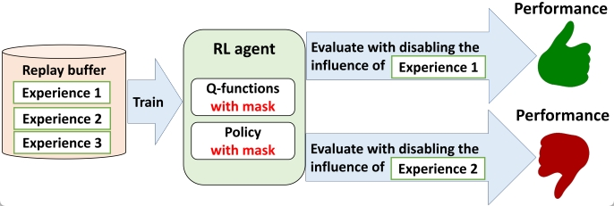

# PIToD — Projected Influence with Turn-Over Dropout

Source code for ["Which Experiences Are Influential for RL Agents? Efficiently Estimating The Influence of Experiences"](https://openreview.net/forum?id=pUvF97zAu9) (RLC 2025) · [(poster)](https://drive.google.com/file/d/1fqd5UPUNOQniG-CshmdFFPxEG9m7W4hS/view?usp=sharing) · [(slides)](https://drive.google.com/file/d/1JjOMvA-oF7bas2OJmO_en6mJAtNGoLjs/view?usp=sharing)

PIToD estimates and disables the influence of stored experiences on an RL agent's performance **without retraining**.



What is this useful for? When an RL agent fails to learn, PIToD identifies and disables experiences that harm it — without retraining from scratch:

https://github.com/user-attachments/assets/07d14535-bf16-4069-893a-f08f9ee9c7c7

https://github.com/user-attachments/assets/a47d8a54-a794-4e04-a48d-05e03ad31e9e


## How It Works

**Experience groups & Turn-Over Dropout (ToD).** The replay buffer is divided into contiguous blocks (~5000 transitions each). Each group is assigned a binary macro-dropout mask (length 20, ~half zeros) that gates subnetworks in the Q and policy MLPs. This structured dropout creates a natural "fingerprint" per group without any retraining.

**Flip mechanic & TD-flip-delta.** To measure a group's influence, its mask is *flipped* (zeros ↔ ones) and the change in TD error — `E[flip_td − non_flip_td]` — is used as an influence proxy. High positive delta means the group is actively used and influential; consistently low or negative delta marks it as harmful.

**Static PIToD (post-hoc).** After training, influence is estimated by rolling out evaluation episodes with the mask flipped vs. not flipped for each group. This is thorough but expensive (2×`n_eval` rollouts per group).

**Dynamic PIToD (online cleansing).** Runs continuously during training in a three-stage loop:
1. **Seal** — when a group fills up, compute its initial TD-flip-delta score.
2. **Refresh** — every `k_refresh` steps, rescore `b_refresh` old groups with the current network weights.
3. **Prune** — groups that score below `mean − k·std` for `m_strikes` consecutive refresh cycles are evicted from the SumTree, reducing their sampling probability toward zero.

This keeps harmful experiences from being replayed throughout training rather than only identifying them after the fact.


## Setup

### Local (conda recommended)

```bash
conda env create -f environment.yml
conda activate pitod          # or whatever name is in environment.yml
pip install -e .
```

MuJoCo 2.1.0 is required. Download it and follow the [mujoco-py installation guide](https://github.com/openai/mujoco-py) — you will need a license key.

Alternatively with pip only:
```bash
pip install -r requirements.txt
# then install mujoco-py manually per the guide above
```

### Google Colab

Open **`PiToD-smoke.ipynb`** (quick validation, ~15 epochs) or **`PiToD.ipynb`** (full run, ~40 epochs). The first cell mounts Google Drive and installs all dependencies including MuJoCo automatically.


## Running Experiments

### Static PIToD

Post-hoc influence estimation on a SAC agent:

```bash
python main-TH.py -info SAC+ToD -env Hopper-v2 -seed 0 -gpu_id 0 \
    -layer_norm 1 -layer_norm_policy 1
```

DroQ and reset agent variants:
```bash
# DroQ
python main-TH.py -info DroQ+ToD -env Hopper-v2 -seed 0 -gpu_id 0 \
    -layer_norm 1 -layer_norm_policy 1 -target_drop_rate 0.01

# reset
python main-TH.py -info reset+ToD -env Hopper-v2 -seed 0 -gpu_id 0 \
    -layer_norm 1 -layer_norm_policy 1 -reset_interval 100000
```

Batch launchers for multiple environments and seeds: `run_experiment-pitod.sh`, `run_experiment-pitod-reset-droq.sh`.

### Dynamic PIToD

Online cleansing during training. Four replay modes are available: `uniform`, `per`, `static_pitod`, `dynamic_pitod`.

```bash
python dynamic-main-TH.py -info dyn+ToD -env Hopper-v2 -seed 0 -gpu_id 0 \
    -layer_norm 1 -layer_norm_policy 1 \
    --replay_mode dynamic_pitod --k_refresh 5000 --b_refresh 32
```

Key dynamic flags:

| Flag | Default | Description |
|------|---------|-------------|
| `--replay_mode` | `uniform` | Sampling strategy (`uniform`, `per`, `static_pitod`, `dynamic_pitod`) |
| `--k_refresh` | `5000` | Env-steps between rescoring cycles |
| `--b_refresh` | `32` | Groups rescored per cycle |
| `--m_strikes` | `3` | Consecutive low-score cycles before eviction |
| `--pitod_alpha` | `0.6` | Priority exponent for SumTree sampling |
| `--n_samples_per_group` | `64` | Transitions sampled for TD-flip-delta |
| `--dynamic_warmup_steps` | `5000` | Steps before dynamic cleansing activates |
| `--prune_warmup_steps` | `0` | Extra delay before pruning begins |
| `--early_phase_steps` | — | Override `k_refresh`/`b_refresh` for early training |
| `--h2_log` | `0` | Set to `1` to save group score evolution to `h2_dynamic_scores.bz2` |

Batch launcher for focused Hopper screen: `scripts/run_dynamic_pitod_screen.sh`.

### Smoke Test (< 2 min, verifies install)

```bash
python dynamic-main-TH.py -env Hopper-v2 -seed 0 -epochs 4 \
    -steps_per_epoch 1000 -info smoke --replay_mode dynamic_pitod \
    -start_steps 500 -experience_group_size 1000 \
    --k_refresh 250 --b_refresh 8 --dynamic_warmup_steps 250 -gpu_id 0
```

### Runtime & Memory Tips

- **Faster evaluation:** reduce `-n_eval` (default `10` → `1`) or increase `-experience_group_size` (default `5000` → `10000`) to cut the number of groups evaluated per epoch.
- **Lower VRAM:** reduce `-hidden_sizes` (e.g., `256 → 80` per layer).

```bash
python main-TH.py -info SAC+ToD -env Hopper-v2 -seed 0 -gpu_id 0 \
    -layer_norm 1 -layer_norm_policy 1 \
    -n_eval 1 -experience_group_size 10000 -hidden_sizes 80 80
```

### Using the Notebooks

| Notebook | Purpose |
|----------|---------|
| `PiToD-smoke.ipynb` | 15-epoch run, 3 seeds — quick validation of setup and results |
| `PiToD.ipynb` | Full 40-epoch run with learning curve and cleansing analysis plots |

Both notebooks run static and dynamic PIToD on Hopper-v2 and generate comparison plots (return, Q-bias, experience cleansing metrics).


## Analyzing Results

Results are written to `runs/<info>/redq_sac_<env>_<replay_mode>/redq_sac_<env>_<replay_mode>_s<seed>/`:
- `progress.txt` — per-epoch training log (return, Q-bias, policy loss, etc.)
- `config.json` — full hyperparameter record
- `h2_dynamic_scores.bz2` — group score evolution (when `--h2_log 1`)

Visualization scripts:

```bash
python plot_main_results_pitod.py       # static PIToD: return, Q-bias, influence ratios
python analyze_dynamic_pitod_study.py   # dynamic PIToD: group diagnostics and screening
python plot_screen_comparison.py        # static vs dynamic side-by-side comparison
```


## Leave-One-Out (LOO) Baseline

A simple LOO implementation for comparison:

```bash
python loo-main-TH.py -info LOO -env Hopper-v2 -seed 0 -gpu_id 0 \
    -layer_norm 1 -layer_norm_policy 1
```

Batch launcher: `run_experiment-loo.sh`. Results are saved under `runs/.../baseline`.


## Citation

```bibtex
@inproceedings{hiraoka2025which,
  title={Which Experiences Are Influential for {RL} Agents? Efficiently Estimating The Influence of Experiences},
  author={Takuya Hiraoka and Takashi Onishi and Guanquan Wang and Yoshimasa Tsuruoka},
  booktitle={Reinforcement Learning Conference},
  year={2025},
  url={https://openreview.net/forum?id=pUvF97zAu9}
}
```
